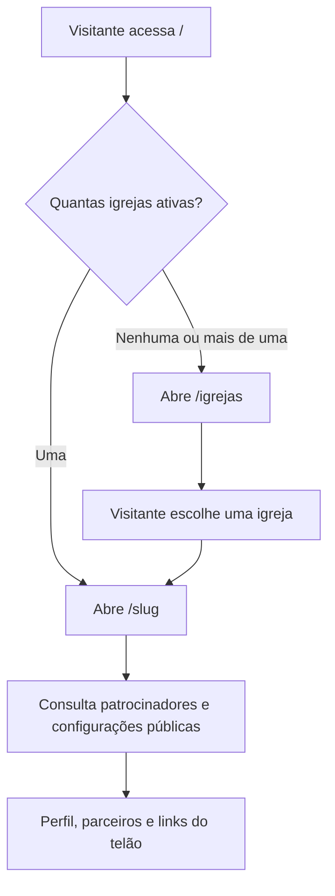
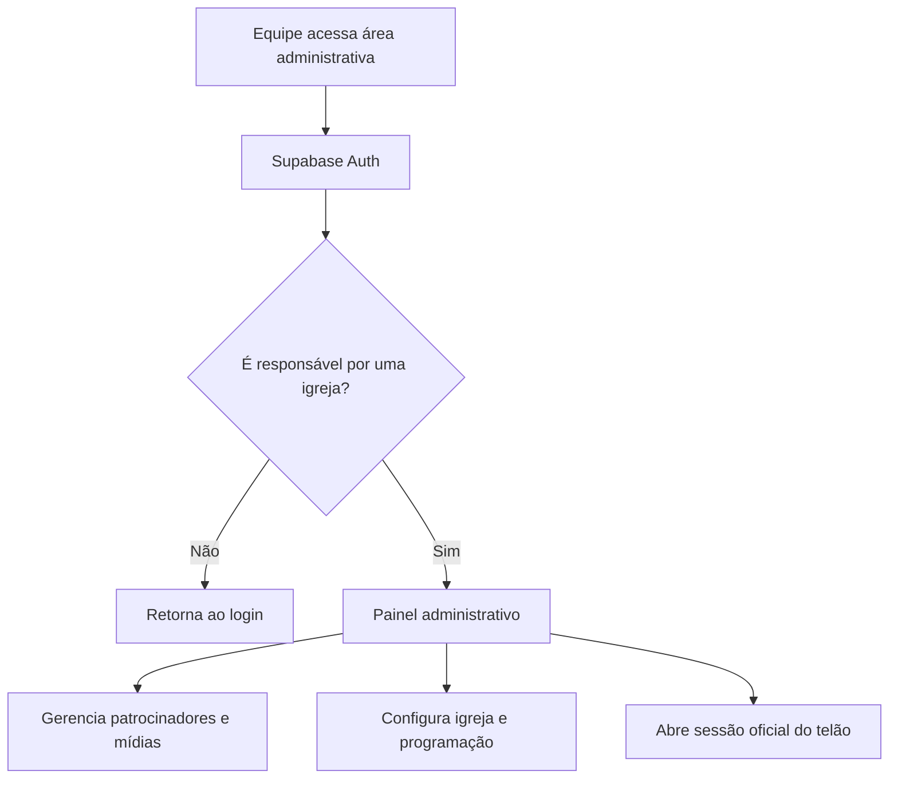
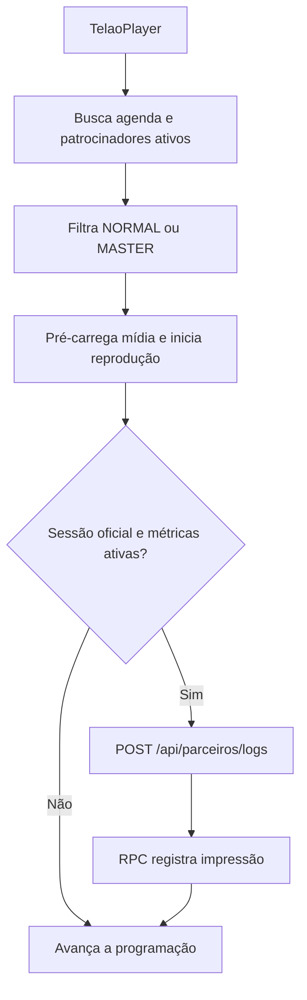
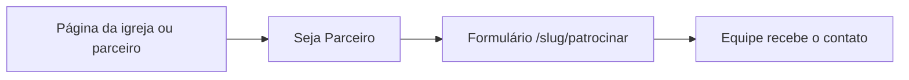

# Fluxos da Aplicação

## Entrada pública

```mermaid
flowchart TD
  A[Visitante acessa /] --> B{Quantas igrejas ativas?}
  B -- Uma --> C[Abre /slug]
  B -- Nenhuma ou mais de uma --> D[Abre /igrejas]
  D --> E[Visitante escolhe uma igreja]
  E --> C
  C --> F[Consulta patrocinadores e configurações públicas]
  F --> G[Perfil, parceiros e links do telão]
```

## Administração

```mermaid
flowchart TD
  A[Equipe acessa área administrativa] --> B[Supabase Auth]
  B --> C{É responsável por uma igreja?}
  C -- Não --> D[Retorna ao login]
  C -- Sim --> E[Painel administrativo]
  E --> F[Gerencia patrocinadores e mídias]
  E --> G[Configura igreja e programação]
  E --> H[Abre sessão oficial do telão]
```

## Reprodução e métricas

```mermaid
flowchart TD
  A[TelaoPlayer] --> B[Busca agenda e patrocinadores ativos]
  B --> C[Filtra NORMAL ou MASTER]
  C --> D[Pré-carrega mídia e inicia reprodução]
  D --> E{Sessão oficial e métricas ativas?}
  E -- Sim --> F[POST /api/parceiros/logs]
  F --> G[RPC registra impressão]
  E -- Não --> H[Avança a programação]
  G --> H
```

## Interesse em parceria

```mermaid
flowchart LR
  A[Página da igreja ou parceiro] --> B[Seja Parceiro]
  B --> C[Formulário /slug/patrocinar]
  C --> D[Equipe recebe o contato]
```
